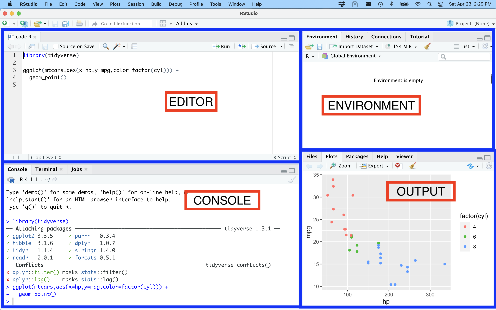
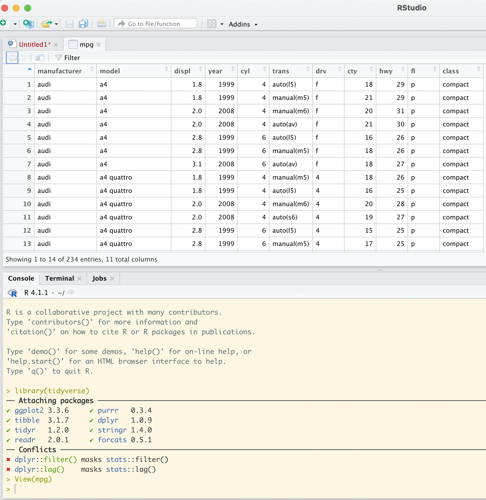

background-image: url(https://research.mcmaster.ca/app/uploads/2019/11/20180706-152629-McMaster-University-Campus-0004-1.jpg)

```{r setup, include=FALSE}
options(htmltools.dir.version = FALSE)
library(kableExtra)
```

---
class: inverse, center, middle

# Summary Week 1 

---

# R and RStudio

```{r echo=FALSE, out.width = '90%', fig.cap="Source: Modern Dive Chapter 1"}
knitr::include_graphics("images/motor.png")
```
---

# RStudio

```{r echo=FALSE, out.width = '80%', fig.cap="Source: Modern Dive Chapter 1"}

```

---

Every time you open R:

```{r}
library(tidyverse)
```

This shows that it worked. It tells you that 8 packages are attached.

It also tells you that the function filter from the stats packaged is now masked by filter from dplyr.

---

```{r eval=FALSE}
View(mpg)
```
```{r,echo=FALSE,out.width = '60%'}

```
---

```{r}
glimpse(mpg)
```

---
class: inverse, middle, center

# Two different philosophies to learning R (one very quick word)

### <p style="color:grey;">math + base R (not really covered)</p>
### <p style="color:green;">data analysis with examples (the focus of this course)</p>

---
class: inverse, middle, center

# Data visualisation

---

## Empty graph

```{r out.width='40%'}
ggplot(data = mpg)
```

---

## Adding a layer of points

```{r out.width='40%'}
ggplot(data = mpg) +
  geom_point(aes(x=displ,y=hwy))
```

---
## General graph template

```{r eval=FALSE}
ggplot(data = <DATA>) + 
  <GEOM_FUNCTION>(mapping = aes(<MAPPINGS>))
```

---

## Adding an aesthetic for color (by car class)

```{r out.width='40%'}
ggplot(data = mpg) + 
  geom_point(aes(x=displ,y=hwy,color=class), size=3)
```

---

## Adding an aesthetic for size (by car class)

```{r out.width='40%'}
ggplot(data = mpg) + 
  geom_point(aes(x=displ,y=hwy,size=class))
```
---

## Notice the difference

.pull-left[

```{r out.width='70%',warning=FALSE}
ggplot(data = mpg) + 
  geom_point(aes(x=displ,y=hwy,size=class))
```
]
.pull-right[
```{r out.width='70%'}
ggplot(data = mpg) + 
  geom_point(aes(x=displ,y=hwy),size=3)
```
]
---

## Notice the difference

.pull-left[
```{r out.width='70%'}
ggplot(data = mpg) + 
  geom_point(aes(x=displ,y=hwy),size=12)
```
]
.pull-right[
```{r out.width='70%'}
ggplot(data = mpg) + 
  geom_point(aes(x=displ,y=hwy,size=12))
```
]
---

## Notice the difference

.pull-left[
```{r out.width='70%'}
ggplot(data = mpg) + 
  geom_point(aes(x=displ,y=hwy,color='class'))
```
]
.pull-right[
```{r out.width='70%'}
ggplot(data = mpg) + 
  geom_point(aes(x=displ,y=hwy,color=class))
```
]

---
## Facets
```{r out.width='40%'}
ggplot(data = mpg) +
  geom_point(aes(x=displ,y=hwy)) +
  facet_wrap(~drv)
```
---
## Facets
```{r out.width='40%'}
ggplot(data = mpg) +
  geom_point(aes(x=displ,y=hwy)) +
  facet_grid(cols = vars(drv),rows = vars(class))
```
---
## Transformations

```{r out.width='40%'}
ggplot(data = mpg) + 
  geom_bar(mapping = aes(x = class))
```
---
## Transformations
.pull-left[
```{r}
demo <- tribble(
  ~cut,         ~freq,
  "Fair",       1610,
  "Good",       4906,
  "Very Good",  12082,
  "Premium",    13791,
  "Ideal",      21551
)
```
]

.pull-right[
```{r out.width='60%'}
ggplot(data = demo) +
  geom_bar(mapping = aes(x = cut, y = freq),
           stat = "identity")
```
]
---

## Transformations
.pull-left[
```{r}
(demo <- tribble(
  ~age, ~overall,~low.income,~high.income,
  "18-34",1610,    800, 810,
  "35-54",4906,    1717, 3189,
  "55+",12082,   10000, 2082
))
```
]

.pull-right[
```{r out.width='60%'}
ggplot(data = demo) +
  geom_bar(mapping = aes(x = age,
                         y = overall),
           stat = "identity")
```
]
---

.pull-left[
```{r out.width='60%'}
ggplot(data = demo) +
  geom_bar(mapping = aes(x = age,
                         y = low.income),
           stat = "identity")
```
]
.pull-right[
```{r out.width='60%'}
ggplot(data = demo) +
  geom_bar(mapping = aes(x = age,
                         y = high.income),
           stat = "identity")
```
]
---

## Problems

Plus sign on wrong line.

```{r eval=FALSE}
ggplot(data = mpg) 
  + geom_point(aes(x=displ,y=hwy,size=12)) #<<
```

One too many `)` on line 1 and one missing on line 2.

```{r eval=FALSE}
ggplot(data = mpg)) + #<<
  geom_point(aes(x=displ,y=hwy,size=12) #<<
```

---

## Using help

```{r}
?coord_fixed
```
.pull-left[
```{r out.width='70%'}
ggplot(data = mpg, mapping =
         aes(x = displ, y = hwy)) + 
  geom_point()
```
]
.pull-right[
```{r, out.width='70%'}
ggplot(data = mpg, mapping =
         aes(x = displ, y = hwy)) + 
  geom_point() + coord_fixed()
```
]

---
class: inverse, middle, center

# Summary (Section 3.10 in R4DS)

---

Up to seven parameters. 

```{r, eval=FALSE}
ggplot(data = <DATA>) + 
  <GEOM_FUNCTION>(
     mapping = aes(<MAPPINGS>),
     stat = <STAT>, 
     position = <POSITION>
  ) +
  <COORDINATE_FUNCTION> +
  <FACET_FUNCTION>
```
---
```{r}
library(randomNames)
library(countrycode);set.seed(111)
demo <- tibble(names=randomNames(250),
       age=round(runif(250,18,85)),
       educ_years=round(rnorm(250,14,3)),
       country=sample(sort(codelist$country.name.en[codelist$continent=="Oceania"]),
                      250,replace=TRUE))
```
```{r echo=FALSE}
knitr::kable(demo, format = 'html')
```
---
```{r out.width='50%'}
ggplot(demo) +
  geom_bar(aes(x=country,fill=country)) +
  coord_flip() + theme(legend.position = "none")
```
---
```{r}
demo_count <- demo %>%
  group_by(country) %>%
  count()
knitr::kable(demo_count, format = 'html')
```
---
.pull-left[
```{r out.width='80%'}
ggplot(demo) +
  geom_bar(aes(x=country,fill=country)) +
  coord_flip() +
  theme(legend.position = "none")
```
]
.pull-right[
```{r out.width='80%'}
ggplot(demo_count) +
  geom_bar(aes(x=country,y=,n,fill=country),
           stat='identity') +
  coord_flip() +
  theme(legend.position = "none")
```
]

---
class: inverse, middle, center

# Exercices

### 3.3.1, 3.5.1, 3.6.1, 3.7.1, 3.8.1, 3.9.1

### Solutions: https://jrnold.github.io/r4ds-exercise-solutions/