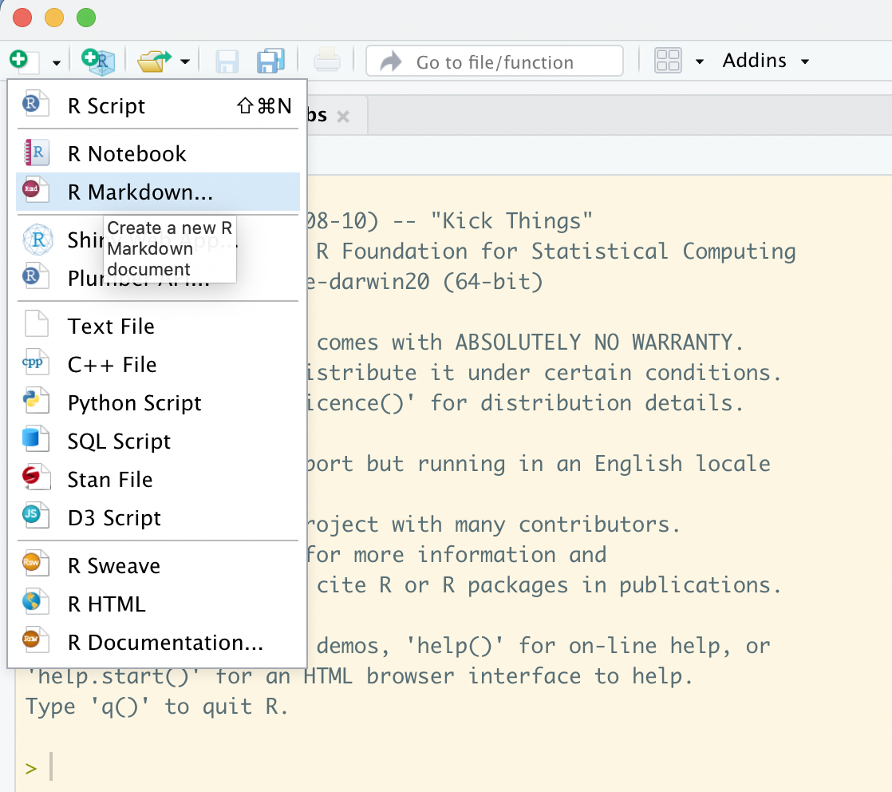
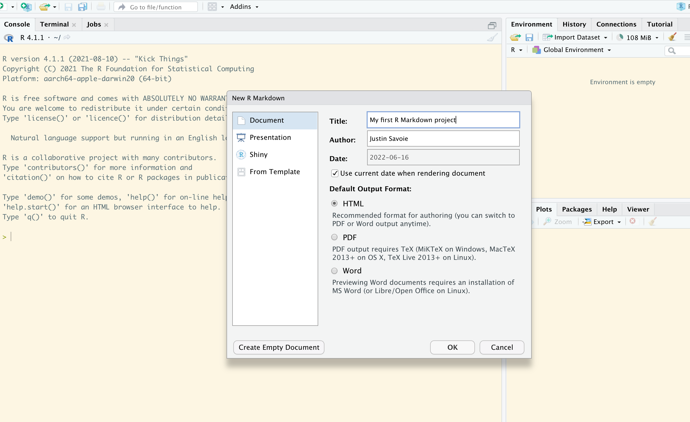
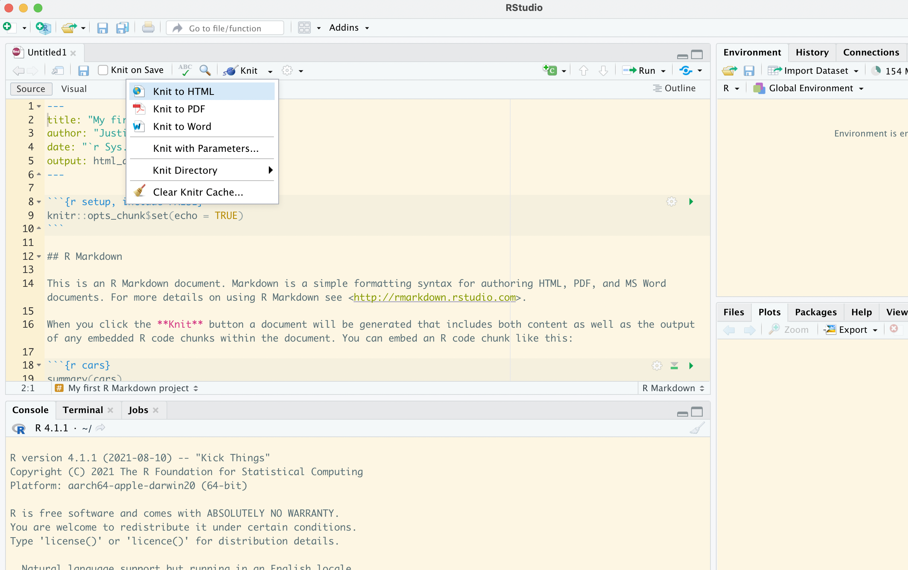
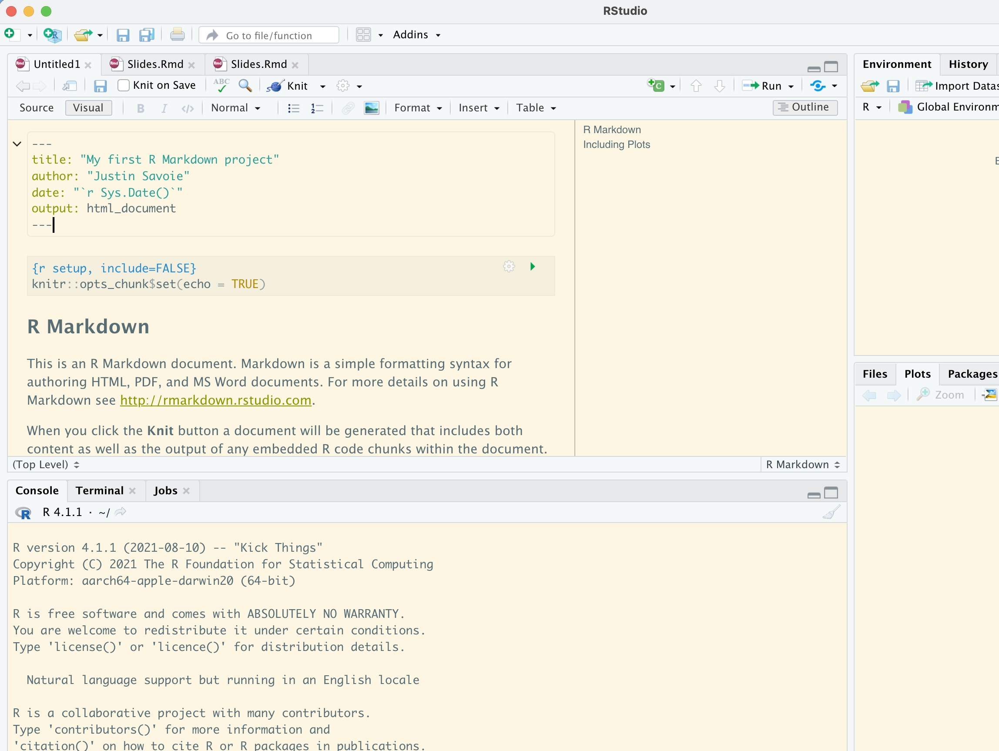

```{r setup, include=FALSE}
options(htmltools.dir.version = FALSE)
library(tidyverse)
```

class: inverse, center, middle

# R Markdown
## An authoring framework for data science

---

# R Markdown

- for communicating to decision makers
- for collaborating with other data scientists
- as an environment in which to do data science


- "Here's some data, could you run cross-tabs, run these six models, export all this in pdf format. I'd need this tomorrow / no need for clean formatting."
- R Markdown is also great for slide decks (this deck), books (R4DS) and more (dissertations, reports, etc.)

---
```{r echo=FALSE, out.width = '90%'}

```
---
```{r echo=FALSE, out.width = '90%'}

```
---
```{r echo=FALSE, out.width = '90%'}

```
---
```{r echo=FALSE, out.width = '90%'}

```
---

# Code chunks

To run code inside an R Markdown document, type the chunk delimiters

```` ```{r} ```` and ```` ``` ````.

Chunks can be given an optional name: ```` ```{r by-name} ````.

# Chunk options

- `eval=FALSE` prevents code from being evaluated
- `include = FALSE` runs the code, but doesn’t show the code or results in the final document. 
- `echo = FALSE` prevents code, but not the results from appearing in the finished file.
- `message = FALSE` or `warning = FALSE`

---
class: inverse, center, middle

# Example with 2015 CES data in R Markdown
