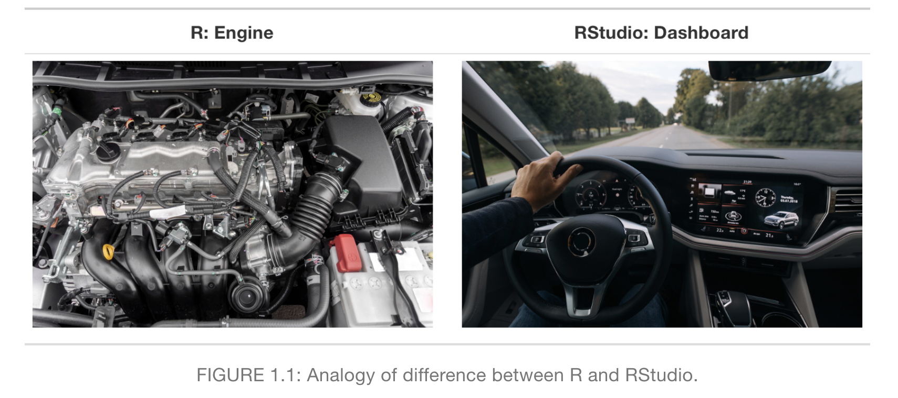
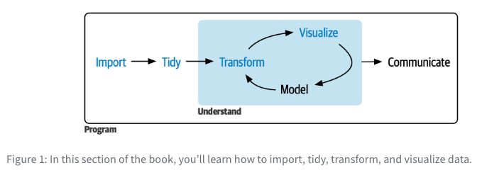

background-image: url(https://research.mcmaster.ca/app/uploads/2019/11/20180706-152629-McMaster-University-Campus-0004-1.jpg)

```{r setup, include=FALSE}
options(htmltools.dir.version = FALSE)
library(kableExtra)
```

---
class: inverse, center, middle

# Summary Week 1 

---

# R and RStudio

```{r echo=FALSE, out.width = '90%', fig.cap="Source: Modern Dive Chapter 1"}

```
---

# RStudio

```{r echo=FALSE, out.width = '80%', fig.cap="Source: Modern Dive Chapter 1"}
knitr::include_graphics("images/4panes.png")
```

---

Every time you open R:

```{r}
library(tidyverse)
```

This shows that it worked. It tells you that 8 packages are attached.

It also tells you that the function filter from the stats packaged is now masked by filter from dplyr.

---

```{r eval=FALSE}
View(mpg)
```
```{r,echo=FALSE,out.width = '60%'}
knitr::include_graphics("images/View.png")
```
---

```{r}
glimpse(mpg)
```

---
class: inverse, middle, center

# Two different philosophies when learning R (one very quick word about it)

### <p style="color:grey;">math + base R (not really covered)</p>
### <p style="color:green;">data analysis with examples (the focus of this course) + tidyverse</p>

---

.pull-left[

base R

```{r out.width='70%',warning=FALSE}
(df <- data.frame(x=c(1,2),y=c(6,7)))
df$z <- c(10,11)
df
df[,c("x")]
```
]
.pull-right[

tidyverse

```{r out.width='70%'}
# library(tidyverse)
(df <- tibble(x=c(1,2),y=c(6,7)))
(df <- df |> mutate(z=c(10,11)))
df |> select(x)
```
]

---

# The “whole game” of data science

```{r echo=FALSE, out.width = '70%', fig.cap="Source: RFDS2"}

```

---

class: inverse, middle, center

# Data visualisation

---

```{r out.width='50%', message=FALSE, warning=FALSE,echo=FALSE,fig.retina = 2}
library(palmerpenguins)
library(ggthemes)
ggplot(
  data = penguins,
  mapping = aes(x = flipper_length_mm, y = body_mass_g)
) +
  geom_point(aes(color = species, shape = species)) +
  geom_smooth(method = "lm") +
  labs(
    title = "Body mass and flipper length",
    subtitle = "Dimensions for Adelie, Chinstrap, and Gentoo Penguins",
    x = "Flipper length (mm)", y = "Body mass (g)",
    color = "Species", shape = "Species"
  ) +
  scale_color_colorblind()
```

---

## Empty graph

```{r out.width='30%',fig.retina = 2}
ggplot(data = mpg)
```

---

## Adding structure through mapping

```{r out.width='30%',fig.retina = 2}
ggplot(
  data = penguins,
  mapping = aes(x = flipper_length_mm, y = body_mass_g)
)
```

---

## Addings points

```{r out.width='30%',fig.retina = 2}
ggplot(
  data = penguins,
  mapping = aes(x = flipper_length_mm, y = body_mass_g)
) + geom_point()
```

---

## Addings colors for groups

```{r out.width='30%',fig.retina = 2}
ggplot(
  data = penguins,
  mapping = aes(x = flipper_length_mm, y = body_mass_g, color = species)
) + geom_point()
```

---

## Adding lines of fit

```{r out.width='25%',fig.retina = 2}
ggplot(data = penguins,
       mapping = aes(x = flipper_length_mm, y = body_mass_g, color = species)) +
  geom_point() + geom_smooth(method = "lm")
```

---

## The full graph

```{r out.width='25%',fig.retina = 2, message=FALSE,warning=FALSE}
ggplot(
  data = penguins,
  mapping = aes(x = flipper_length_mm, y = body_mass_g)) +
  geom_point(aes(color = species, shape = species)) +
  geom_smooth(method = "lm") +
  labs(title = "Body mass and flipper length",
    subtitle = "Dimensions for Adelie, Chinstrap, and Gentoo Penguins",
    x = "Flipper length (mm)", y = "Body mass (g)",
    color = "Species", shape = "Species"
  ) + scale_color_colorblind()
```

---

## ggplot2 calls

.pull-left[

arguments are named

```{r out.width='50%',warning=FALSE}
ggplot(
  data = penguins,
  mapping = aes(x = flipper_length_mm, y = body_mass_g)
) +
  geom_point()
```
]
.pull-right[

arguments are not named

```{r  out.width='50%',warning=FALSE}
ggplot(penguins, 
       aes(x = flipper_length_mm,
           y = body_mass_g)) + 
  geom_point()
```
]

---

## Visualizing distributions for categorical variables

You could reorder with `fct_infreq()`

```{r out.width='35%',fig.retina = 2}
ggplot(penguins, aes(x = species)) +
  geom_bar()
```

---

## Visualizing distributions for a continuous variable

```{r out.width='35%',fig.retina = 2}
ggplot(penguins, aes(x = body_mass_g)) +
  geom_histogram(binwidth = 200)
```

---

## Visualizing distributions using a density

```{r out.width='35%',fig.retina = 2}
ggplot(penguins, aes(x = body_mass_g)) +
  geom_density()
```

---

## Visualizing the relationship between a categorical and a continuous variable
```{r out.width='35%',fig.retina = 2}
ggplot(penguins, aes(x = species, y = body_mass_g)) +
  geom_boxplot()
```

---


## Visualizing the relationship between a categorical and a continuous variable
```{r out.width='35%',fig.retina = 2}
ggplot(penguins, aes(x = body_mass_g, color = species, fill = species)) +
  geom_density(alpha = 0.5)
```

---

## Visualizing the relationship between two categorical variables
```{r out.width='35%',fig.retina = 2}
ggplot(penguins, aes(x = island, fill = species)) +
  geom_bar()
```

---

## Visualizing the relationship between two categorical variables
```{r out.width='35%',fig.retina = 2}
ggplot(penguins, aes(x = island, fill = species)) +
  geom_bar(position = "fill")
```

---

## Visualizing the relationship between two categorical variables

```{r fig.width = 10,fig.height = 6,fig.retina = 2, echo=FALSE, message=FALSE, warning=TRUE}
library(haven)
library(tidyverse)
library(srvyr)
df <- read_stata("~/Downloads/dataverse_files_CES2021/2021 Canadian Election Study v1.0.dta")
df |>
  group_by(cps21_province, cps21_spend_just_law) |>
  summarize(n = n()) |>
  mutate(percentage = n / sum(n) * 100) |>
  ggplot(aes(x = as_factor(cps21_spend_just_law), y = percentage, fill = as_factor(cps21_province))) +
  geom_bar(stat = "identity", position = position_dodge(width = 0.9)) +
  labs(y = "Percentage",fill="Province",x="How much should the federal government spend on Justice/Law")
```

---

```{r, fig.width = 12,fig.height = 6,fig.retina = 2, echo=FALSE, message=FALSE, warning=TRUE}
df |>
  group_by(cps21_province, cps21_spend_just_law) |>
  summarize(n = n()) |>
  mutate(percentage = n / sum(n) * 100) |>
  ggplot(aes(fill = as_factor(cps21_spend_just_law), y = percentage, x = as_factor(cps21_province),
         label=round(percentage))) +
  geom_bar(stat = "identity") +
  labs(fill = "Answer choice",x="Province",title="How much should the federal government spend on Justice/Law",y="Percentage") +
  geom_text(position=position_stack(vjust=0.5)) + coord_flip()
```

---


## Two numerical variables
```{r out.width='35%',fig.retina = 2}
ggplot(penguins, aes(x = flipper_length_mm, y = body_mass_g)) +
  geom_point()
```

---

## Three variables (or more!)

```{r out.width='35%',fig.retina = 2}
ggplot(penguins, aes(x = flipper_length_mm, y = body_mass_g)) +
  geom_point(aes(color = species, shape = species)) +
  facet_wrap(~island)
```

---

## Saving a plot

```{r out.width='30%',fig.retina = 2}
ggplot(penguins, aes(x = flipper_length_mm, y = body_mass_g)) +
  geom_point()
ggsave(filename = "penguin-plot.png")
```

---

## Problems

Plus sign on wrong line.

```{r eval=FALSE}
ggplot(data = mpg) 
  + geom_point(aes(x=displ,y=hwy,size=12)) #<<
```

One too many `)` on line 1 and one missing on line 2.

```{r eval=FALSE}
ggplot(data = mpg)) + #<<
  geom_point(aes(x=displ,y=hwy,size=12) #<<
```

---

class: inverse, middle, center

# Exercices

### 2.2.5, 2.4.3, 2.5.5

### Solutions: https://r4ds-solutions.nhsrcommunity.com/data-visualize.html

---

## Note on making these slides

I use R Markdown (extension for these syntax files rmd) and xaringan to make these slides: https://bookdown.org/yihui/rmarkdown/xaringan.html

RMarkdown is a reporting tool that enables the integration of R code, its output (such as figures and tables), and narrative text within a single document, which can then be exported to various formats including HTML, PDF, and Microsoft Word.

Recently people have started moving to Quarto (extension is qmd). You can read more if you are curious: https://yihui.org/en/2022/04/quarto-r-markdown/

I'll say more about this later in the semester. Tools exists for reporting (e.g., writing reports, decks, etc.)

To get the syntax (the R Markdown code files) for these slides, you can change the url to ".../slides.rmd".