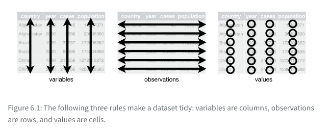
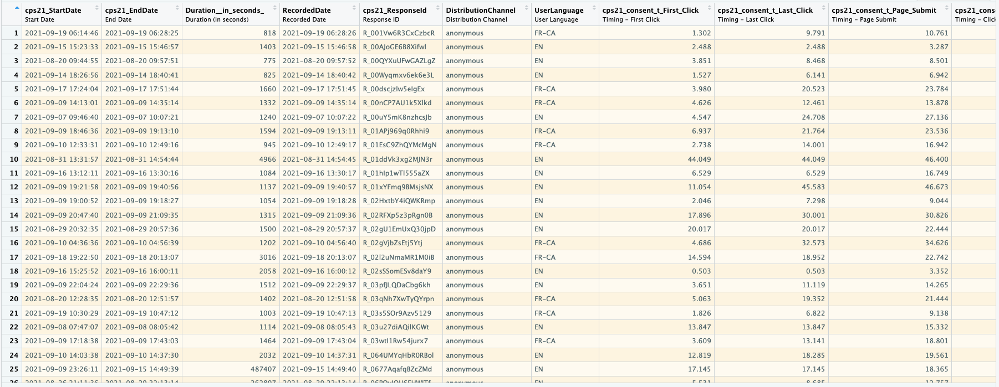

```{r setup, include=FALSE}
options(htmltools.dir.version = FALSE)
library(kableExtra)
library(tidyverse)
```

class: inverse, center, middle

# Homework 1

Solution code for HW1 posted on the website tomorrow. 

We will discuss it next week.

---

class: inverse, center, middle

# Paths

---

class: inverse, center, middle

# Code style

This is chapter 5 in the book. Optional reading.

---

# Names

- Use lowercase separated with `_`.

- Use names that are easy to understand.

- Be consistent. For example don't have: `dataset_ON`, `dataset_QC` and `datas_BC` if these three objects are three datasets for the three provinces.

---

# Spaces

- Put spaces on either side of mathematical operators apart from `^` (i.e. `+`, `-`, `==`, `<`, ...), and around the assignment operator (`<-`). 

```{r, eval=FALSE}
# Strive for
z <- (a + b)^2 / d
# Avoid
z<-( a + b ) ^ 2/d
```

- Don’t put spaces inside or outside parentheses for regular function calls. Always put a space after a comma.

```{r, eval=FALSE}
# Strive for
mean(x, na.rm = TRUE)
# Avoid
mean (x ,na.rm=TRUE)
```

---

# Spaces

- It’s OK to add extra spaces if it improves alignment.

```{r, eval=FALSE}
flights |> 
  mutate(
    speed      = distance / air_time,
    dep_hour   = dep_time %/% 100,
    dep_minute = dep_time %%  100
  )
```

---

# Style

One advice: imitate the code "style" that you see in reputable sources for example in modern R texbooks.

- https://r4ds.hadley.nz

- https://moderndive.com

- https://tellingstorieswithdata.com/

Try to be consistent and coherent.

---

# The pipe (`|>`) 

- We use the pipe `|>` to emphasise a sequence of actions

- The pipe means "THEN"

- `|>` should always have a space before it and should typically

```{r, eval=FALSE}
# Strive for 
flights |>  
  filter(!is.na(arr_delay), !is.na(tailnum)) |> 
  count(dest)
# Avoid
flights|>filter(!is.na(arr_delay),!is.na(tailnum))|>count(dest)
```
---

# The `|>`

- If the function you’re piping into has named arguments (like mutate() or summarize()), put each argument on a new line.

```{r, eval=FALSE}
flights |>  
  group_by(tailnum) |> 
  summarize(
    delay = mean(arr_delay, na.rm = TRUE),
    n = n()
  )
```

---

# The `|>`

- Don't write pipes that are too long. The book says 10-15 lines, use judgment.

- Break into smaller tasks.

---

# ggplot2

- Same rules apply to ggplot2 plots.

```{r, eval=FALSE}
flights |> 
  group_by(month) |> 
  summarize(
    delay = mean(arr_delay, na.rm = TRUE)
  ) |> 
  ggplot(aes(x = month, y = delay)) +
  geom_point() + 
  geom_line()
```

---

class: inverse, center, middle

# Data importing
---

# Reading a csv

```{r, eval=FALSE}
library(tidyverse)
Parliamentarians_subset100 <- read_csv("https://www.justinsavoie.com/pubpol750-2022/homework1/Parliamentarians_subset100.csv")
Parliamentarians_subset100 <- read_csv("~/Downloads/Parliamentarians_subset100.csv")
Parliamentarians_subset100 <- read_csv("/Users/justinsavoie/Downloads/Parliamentarians_subset100.csv")
Parliamentarians_subset100 <- read_csv("/Users/justinsavoie/Documents/personal_repos/personal_website/pubpol750-2022/Homework1/Parliamentarians_subset100.csv")
Parliamentarians_subset100 <- read_csv("C:\\Users\\justinsavoie\\Downloads/Parliamentarians_subset100.csv")
```

# Reading an excel file

```{r}
library(readxl)
Parliamentarians_subset100 <- read_excel("~/Downloads/Parliamentarians.xlsx")
```
---
# Reading spss, sas, stata files
```{r}
library(haven)
#read_spss()
#read_sas()
#read_stata()
library(readstata13)
#readstata13::read.dta13()
```

---

class: inverse, center, middle

# Tidy data
---

# Tidy data

(A)
- Each variable is a column; each column is a variable.
- Each observation is a row; each row is an observation.
- Each value is a cell; each cell is a single value.

(B)
- Put each dataset in a tibble.
- Put each variable in a column.

---

```{r echo=FALSE, out.width = '90%', }

```

---

```{r echo=FALSE, out.width = '90%'}

```

---

# Why tidy data?

- **picking one consistent way of storing data** (and tidyverse functions work well on tidy data)

- works well in R because of vectorization

---

.pull-left[
```{r}
table1
table2
```
]
.pull-right[
```{r}
table3
table4a
table4b
```
]
---
# Pivoting

- Pivoting wider
- Pivoting longer
---
# Pivoting wider

```{r}
table4a
```

```{r}
table4a |>
  pivot_longer(
    cols=c(`1999`,`2000`),
    names_to = 'year',
    values_to = 'cases'
  )
```

---
```{r}
(tidy4a <- table4a |> 
  pivot_longer(
    c(`1999`, `2000`),
    names_to = "year",
    values_to = "cases"
  ))
(tidy4b <- table4b |> 
  pivot_longer(
    c(`1999`, `2000`),
    names_to = "year",
    values_to = "population"
  ))
```
---
# Pivoting wider

```{r}
head(table2,3)
```

```{r}
table2 |>
    pivot_wider(
      names_from = type,
      values_from = count)
```

---

# Missing values

- Explicit vs Implicit

```{r}
(stocks <- tibble(
  year   = c(2015, 2015, 2015, 2015, 2016, 2016, 2016),
  qtr    = c(   1,    2,    3,    4,    2,    3,    4),
  return = c(1.88, 0.59, 0.35,   NA, 0.92, 0.17, 2.66)
))
```

---

- Force explicit

```{r}
stocks |> 
  pivot_wider(
    names_from = year,
    values_from = return)
```

---

```{r}
stocks |> 
  pivot_wider(
    names_from = year,
    values_from = return
  ) |>
  pivot_longer(
    cols=c(`2015`,`2016`),
    names_to='year',
    values_to='return'
  )
```
---

```{r}
stocks |> 
  pivot_wider(
    names_from = year,
    values_from = return
  ) |>
  pivot_longer(
    cols=c(`2015`,`2016`),
    names_to='year',
    values_to='return',
    values_drop_na = TRUE
  )
```
---

```{r}
stocks |> 
  pivot_wider(
    names_from = year,
    values_from = return
  ) |>
  pivot_longer(
    cols=c(`2015`,`2016`),
    names_to='year',
    values_to='return',
    values_drop_na = TRUE
  )
```

---

class: inverse, middle, center

# Exercices

### 6.2.1
