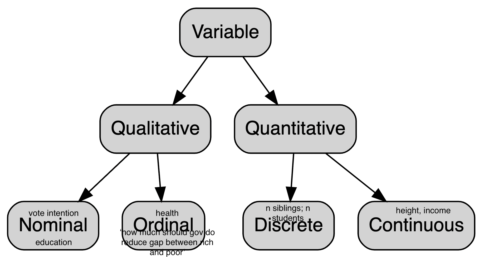

```{r setup, include=FALSE}
options(htmltools.dir.version = FALSE)
library(kableExtra)
library(tidyverse)
```

class: inverse, center, middle

# Summary to date
### Visualization
### Transformation
### Tidy data

---

class: inverse, center, middle

# Exploratory Data Analysis (EDA)

---

### "There are no routine statistical questions, only questionable statistical routines." - Sir David Cox

### "Far better an approximate answer to the right question, which is often vague, than an exact answer to the wrong question, which can always be made precise." - John Tukey

### Your goal during EDA is to <span style="color:blue">develop an understanding of your data</span>.

---

# Some terms

- A variable is a quantity, quality, or property that you can measure. (e.g. satisfaction with policy)

- A value is the state of a variable when you measure it. The value of a variable may change from measurement to measurement. (e.g. Very dissastified, Somewhat dissatisfied, etc.)

- An observation is a set of measurements made under similar conditions (you usually make all of the measurements in an observation at the same time and on the same object). An observation will contain several values, each associated with a different variable. (e.g. Justin's answers to all questions in the survey)

- Tabular data is a set of values, each associated with a variable and an observation. (e.g. your data that fits in a spreadsheed, where rows are individuals and columns variables)

---

# Variable types

```{r echo=FALSE, out.width = '70%'}

```

For more info: https://statsandr.com/blog/variable-types-and-examples/

And then you have variations on these: e.g., [Continuous Data with Lower and Upper Bounds](https://www.cambridge.org/core/journals/political-analysis/article/abs/ordered-beta-regression-a-parsimonious-wellfitting-model-for-continuous-data-with-lower-and-upper-bounds/89F4141DA16D4FC217809B5EB45EEE83) Or you could have an ordinal with a "Don't know"...
---
# Transformations

- Convert ordinal to numeric. For example *How much should the government do to reduce the gap between the rich and the poor? [Much less, Somewhat less, About the same as now, Somewhat more, Much more, Don't know]* 

><space>- Much less --> 1 

><space>- Somewhat less --> 2 

- This is called a Likert-type question. The choices are a Likert scale. 

- Likert (3-choices) (5-choices) or (7-choices) are common in social sciences. 

- They are often converted to numeric. But then, you need to decide what to do with "(6) Don't know." ... Can drop it. Can put it as (3-middle-category).

---

# Transformations

- Convert income numeric to brackets (e.g. <30k, 30-60k ...) 

- Age to age groups

- If you have vote intention maybe you want to convert intention to e.g. "Liberal vs the rest" Or maybe "CPC + PPC" vs the rest.

- Convert a binary category to 1 and 0. e.g. Liberal = 1, the rest = 0.

- Convert income brackets to numeric (e.g. using the median of the bracket). This is seldom done.

---
# Check the codebook!

- female / male / other coded as 1,2,99
- female / male / other coded as 1,2,3
- female / male / other coded as 1,2,3,-99
- female / male / other coded as 1,2,3,60

- a scale from 0-10 coded as 1 to 11 !!!
---
# Variable types in R

- R has six data types (character, numeric, integer, logical, complex, raw). But this is not very important.

- For more info: https://swcarpentry.github.io/r-novice-inflammation/13-supp-data-structures.html

- R has data structures (**vectors**, list, matrix, **data frame**, **factor**). For now we can ignore lists and matrices.

- A tidy data set is a data frame. It's also called a tibble. A tibble is the tidyverse version of the data frame. 

- A data frame has columns that are variables. Those variables can be numbers, character strings or factors. If you extract those variables from the data frame they become vectors. So the columns of the data frame are vectors.

- Numbers and character strings that's straightforward. Factors are labels of text "over" numbers.

---

# EDA on single variable; "univariate exploratory analysis"

- Is the variable a factor, a numeric, a character string ?

- If the variable is continuous, you'll use a histogram.

- If the variable is a numeric, but a count, you'll probably use a bar chart (like if it was a categorical variable).

- If the variable is categorical, you'll use a bar chart.

- If the variable is categorical, you will look at frequencies.

- If the variable is continuous, you will look at min, max, median, mean, standard deviation, kurtosis, skewness.

---

# Categorical variable

```{r, out.width='40%'}
ggplot(data = diamonds) +
  geom_bar(mapping = aes(x = cut))
```
---
# Categorical variable

```{r}
diamonds |>
  group_by(cut) |>
  count()
```
---
# Continuous variable

```{r, out.width='40%'}
ggplot(data = diamonds) +
  geom_histogram(mapping = aes(x = carat), binwidth = 0.5)
```
---

# Continuous variable

```{r, out.width='60%'}
diamonds |>
  summarise(
    min=min(carat),
    max=max(carat),
    median=median(carat),
    mean=median(carat),
    sd=sd(carat),
    IQR=IQR(carat)
  )
```
---
# Thinking about SD and IQR

- Standard deviation and interquartile range are descriptions of your spread.

- SD is the "amount of variation". Variance 

- Imagine in terms of soccer goals:

```{r}
a <- c(0,1,2,0,0,1,0,2)
b <- c(3,9,0,0,1,6,13,10)
sd(a);sd(b);var(a);sd(a)^2
```
---
- IQR gives the spread of the middle of the distribution. IQR is the third quartile minus the first quartile.
- quartile is a type of quantile which divides the number of data points into four parts.
- quantiles are cut points dividing the range of a probability distribution into continuous intervals with equal probabilities

```{r}
c <- c(0,0,0,1,3,6,7,9,10,13,15,20)
IQR(c)
quantile(c,c(0,0.25,0.5,0.75,1))
```

---

```{r, echo=FALSE}
plot(c, rep(1,12), main="", xlab="", ylab="", yaxt="n")
abline(v=0.75, col="black", lwd=2, lty=2)
abline(v=10.75, col="black", lwd=2, lty=2)
```

---
# Other measures for continuous variable

- Skewness: if tail to the right > 0
- Skewness: if tail to the left < 0
- Kurtosis: if flat, platykurtic, < 0
- Kurtosis: if spiked, leptokurtic, > 0
---
```{r,out.width='30%'}
library(e1071)
plot(density(rnorm(1000,10,1)))
skewness(rnorm(1000,10,1))
kurtosis(rnorm(1000,10,1))
```
---
```{r,out.width='30%'}
plot(density(rbeta(1000,1,10)))
skewness(rbeta(1000,1,10))
kurtosis(rbeta(1000,1,10))
```
---
```{r,out.width='30%'}
plot(density(rbeta(1000,10,1)))
skewness(rbeta(1000,10,1))
kurtosis(rbeta(1000,10,1))
```
---
```{r,out.width='30%'}
plot(density(rbeta(1000,2,2)))
skewness(rbeta(1000,2,2))
kurtosis(rbeta(1000,2,2))
```
---
```{r,out.width='30%'}
plot(density(rbeta(1000,2,4)))
skewness(rbeta(1000,2,4))
kurtosis(rbeta(1000,2,4))
```
---
```{r,out.width='30%'}
plot(density(rexp(10000)))
skewness(rexp(10000))
kurtosis(rexp(10000))
```
---
```{r,out.width='30%', message=FALSE, warning=FALSE}
diamonds |>
  summarise(kurtosis=kurtosis(carat),
            skewness=skewness(carat))
ggplot(data = diamonds) +
  geom_histogram(mapping = aes(x = carat))
```

---

# Summary

- Get to know your data. Is it continuous or not?

- If it's not continuous, then you can count the data. Plot the counts with a bar chart. Know what the mode is (the most frequent category), know, generally, the frequency of your variables.

- If it's continuous, calculate the min, the max, the mean, the median. Is it flat, is it spiked, is it skewed, is it very spread out?

- Are there many missing values? 

---

class: inverse, center, middle

# Next week

### Introducing project 1
### Projects Ch. 7
### Quarto

---

class: inverse, center, middle

# Exercices 

### 7.3.4 7.4.1