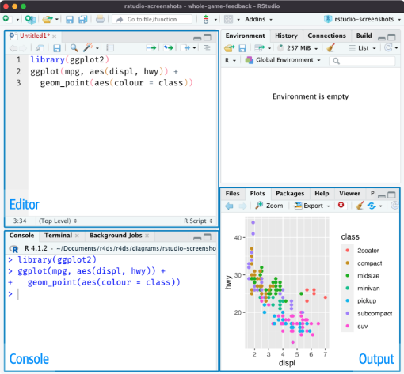
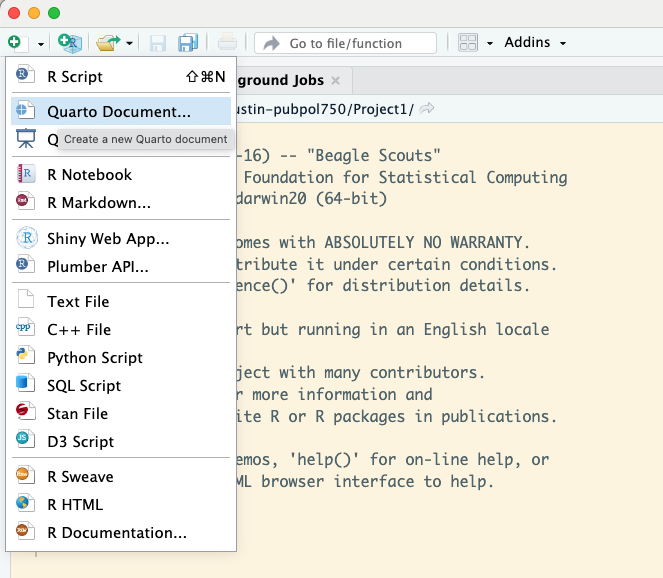
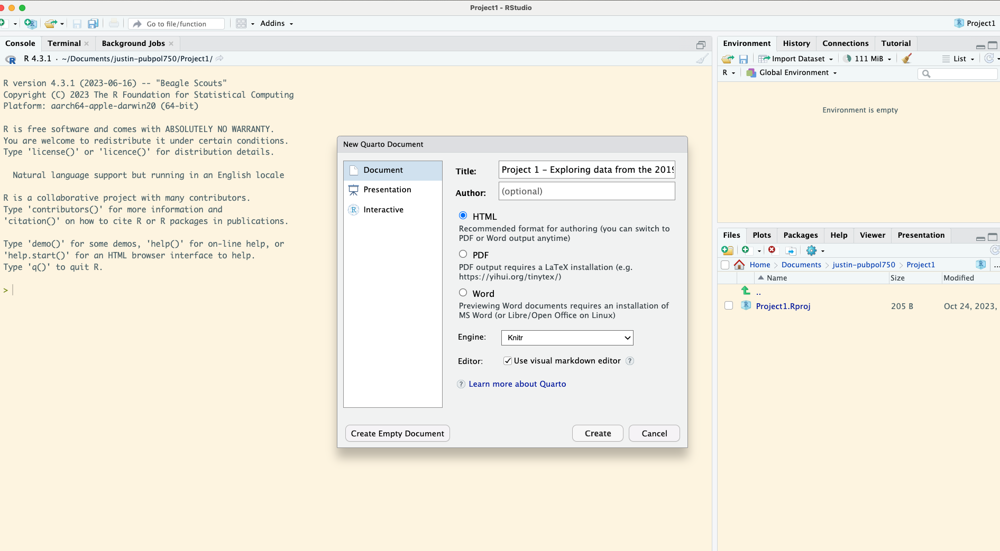
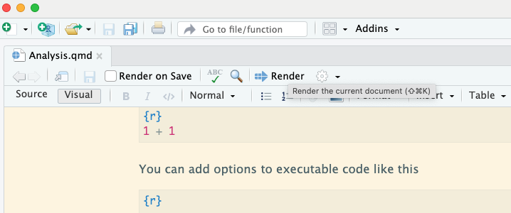

```{r setup, include=FALSE}
options(htmltools.dir.version = FALSE)
library(tidyverse)
```

class: inverse, center, middle

# Scripts and Projects
## R4DS Chapter 7

---

# Scripts

.pull-left[

```{r echo=FALSE, out.width = '90%'}

```

]

.pull-right[

- console is to run quick code (bottom left)
- script is to work on longer chunks of code (top left)
- anything you write in the script, you can save
- anything you write in the console, you don't save
- you send code to the console from the script by clicking run or by hitting Cmd/Ctrl + Enter. The code to run can be highlighted but it doesn't have to: it's it not highlighted it will run the current line/block
- you should read section 7.1 for more details
]

---

# Projects

- your source of truth should be the R scripts
- everything should be reproducible
- you should start with data files and write R code (R code is what we call a script)
- if you send the data and the script to me, I should be able to reproduce everything in one click

- RStudio projects: keep all the files associated with a given project (input data, R scripts, analytical results, and figures) together in one directory
- Inside a project, you only use relative path
- Let's do an example in RStudio (you can also just read 7.2.3 and code along)

---

class: inverse, center, middle

# Quarto
## An open-source scientific and technical publishing system

---

# Quarto

- for communicating to decision makers
- for collaborating with other data scientists and analysts
- as an environment in which to do data science


- "Here's some data, could you run cross-tabs, run these six models, export all this in pdf format. I'd need this tomorrow / no need for clean formatting."
- Quarto is also great for slide decks, books (R4DS) and more (dissertations, reports, etc.)
- Very similar to R Markdown, which was what people used before Quarto

---
```{r echo=FALSE, out.width = '90%'}

```
---
```{r echo=FALSE, out.width = '90%'}

```
---
```{r echo=FALSE, out.width = '90%'}

```
---

# Code chunks

To run code inside an R Markdown document, type the chunk delimiters

```` ```{r} ```` and ```` ``` ````.

We can also do everything in visual mode. 

# Chunk options

- `eval=FALSE` prevents code from being evaluated
- `include = FALSE` runs the code, but doesn’t show the code or results in the final document. 
- `echo = FALSE` prevents code, but not the results from appearing in the finished file.
- `message = FALSE` or `warning = FALSE` prevents messages or warnings from appearing in the finished file
- `results = hide` hides printed output
- `fig-show: hide` hides plot

- **All the details and more in Chapter 29!**

---

class: inverse, center, middle

# Example with 2021 Democracy Checkup
