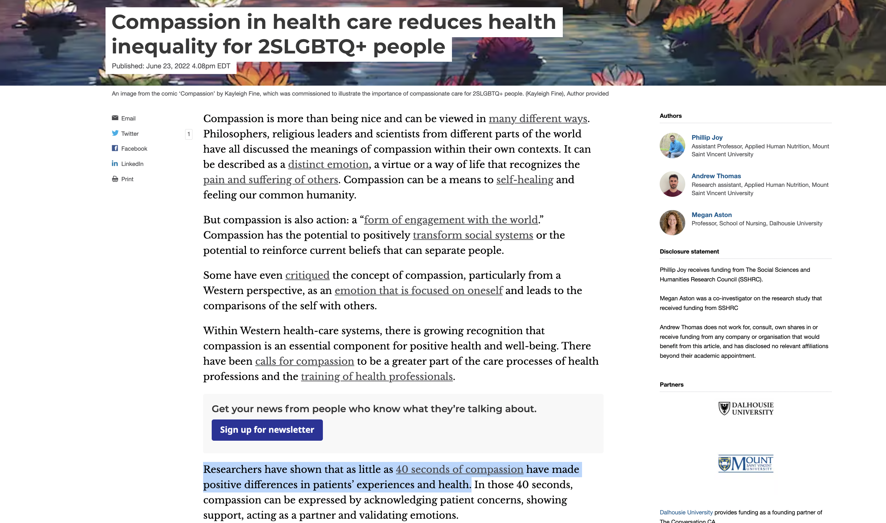
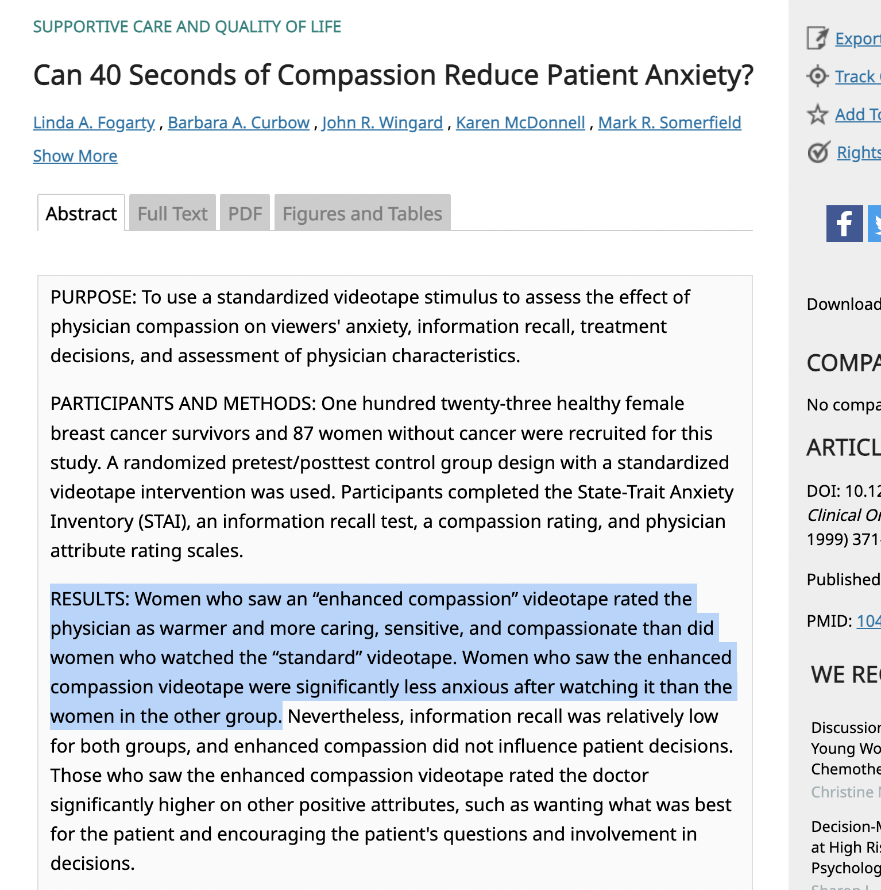

```{r setup, include=FALSE}
options(htmltools.dir.version = FALSE)
library(tidyverse)
```

class: inverse, center, middle

# EDA 2: covariation

---

# Often we:

- Explore variation in one variable (distribution, mean, sd, skew of variable e.g. Age)

- Explore covariation (e.g., how does age relate to income)

- Explore covariation, considering some other variables (e.g., how does age relate to income considering that the relation is different for different social groups). Alternatively, "the relationship between age and income at fixed levels of education".

- This quickly becomes complicated

---

# Covariation

- A categorical and continuous variable (e.g. ed. degree and income)
- Two categorical variables (e.g. ed. degree and vote intention)
- Two continuous variables (e.g. age and income)


- Ambiguous cases (e.g. schooling and life satisfaction - schooling could be degree or year in school, life satisfaction could be categorical, could be a scale from 0 to 100)

- In covariation, generally, there's a dependent variable (we want to explain / understand / predict) and independent variable(s) (we want to use it/them to explain / understand / predict).

---

# Describing vs predicting vs explaining

- **It's always worth it asking why we are doing what we are doing?**

- **Describing**: % of users satisfied with the new interface of your government app

- **Predicting**: using machine learning models to predict the number of customers that will show up at a government office to have the appropriate number of employees (made me think of [this](https://www.cbc.ca/news/canada/nova-scotia/data-analyst-whistleblower-nova-scotia-1.7009463))

- **Explaining**: the causal effect of a treatment on an outcome, for example: estimating the causal effect of attending a private school on student test scores, or on future income

---

# Example in The Conversation

---

```{r echo=FALSE, out.width = '90%'}

```

---
```{r echo=FALSE, out.width = '60%'}

```

---

# Covariation?

- **Result**: Women who saw an “enhanced compassion” videotape rated the physician as warmer and more caring, sensitive, and compassionate than did women who watched the “standard” videotape.

- **first variable is categorical**: those that got the “enhanced compassion” videotape and those that didn't

- **second variable is (probably) continuous e.g. on a scale of 0-10**: rate the physician's compassion

- and then you can **study the distribution of the second variable**, the mean, the sd, how it looks, **by group**

- you could also study "heterogeneity": e.g. is the treatment more effective among young/older women / racialized/white women

- **covariation** means that one variable covaries with an other. Here, of course, it's more than covariation, it's causality. They are arguing that one causes the other.

---

# Covariation: what's the objective?

- description (e.g. any poll you usually see in the news)
- prediction (e.g. some gdp forecasting / machine learning for spam)
- explanation (causal) (e.g. the example above)

- and, of course, this is not always clear: sometimes you start with description, sometimes you aim for explanation but at the end you realize it's only description

- some add "exploration"
- some add "prescription"

---

# Why explanation is difficult?

- Explanation is difficult technically and philosophically
- Causal explanation provides a reason for why a particular event occurred based on the direct influence of another event or factor
- When that other event or factor that serves to explicate (the independent variable) the outcome variable (the dependent variable) can be randomly assigned, explanation is easier: **effect of vaccines on COVID-19 related outcome**
- In some cases it's possible but difficult: **private high school education on future income**
- In some cases it's impossible: **the long term effects of social media use on mental health**
- In many cases, we rely on observational data only, not experimental data.

**Usual solutions**: We may conduct a **randomized experiment**, which eliminates all confounding variables by assigning the treatment at random (when that's possible). Alternatively, if we cannot conduct a randomized experiment and **need to rely on observational data instead, we would need to use statistical methods to control for all confounding variables**. When we use statistical methods this is where people usually disagree on many things.  

**Confounding variables**: external factors that can affect both the independent and dependent variables in a study.

---

# Why explanation is difficult? Two examples

**You have two variables: number of people who go at the swimming pool; number of people who eat ice cream. **

- You cannot explain one from the other. They covary but one does not "explain" or "cause" the other. "Summer" or "temperature" or the interaction between "temperature with precipitations" causes both.

**You have two variables: time spent on social media; mental health.**

- It's a different problem, more interesting, but it's still a very hard problem. Are there intrinsic characteristics (individual level) that lead to both (confounding variables)? Are there structural (institutional, societal) changes that might explain both? Has society evolved in a distinctive way (think consumerism, materialism) that has caused both? Perhaps we can run a randomized experiment for a few months with undegrads. [Meta could even run experiments](https://www.cnbc.com/2023/07/27/science-and-nature-studies-on-facebook-show-algorithm-not-only-problem.html), but it's still debatable what the long term effects are. Very hard to measure.

---

# Excellents texts on the topic

[Statistical Modeling: The Two Cultures](https://projecteuclid.org/journals/statistical-science/volume-16/issue-3/Statistical-Modeling--The-Two-Cultures-with-comments-and-a/10.1214/ss/1009213726.full) (Leo Breiman)

[To Explain or to Predict](https://www.stat.berkeley.edu/~aldous/157/Papers/shmueli.pdf]) (Galit Shmueli)

---

class: inverse, center, middle

# Code along for exercices