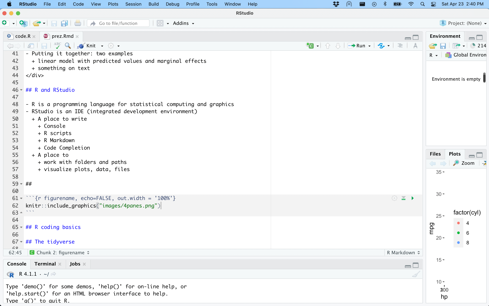
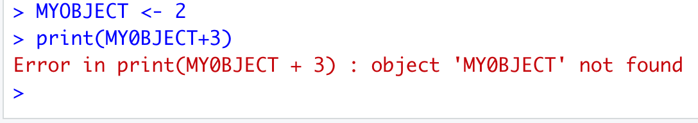
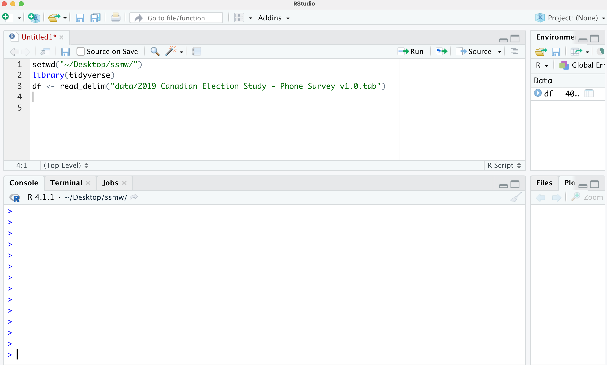
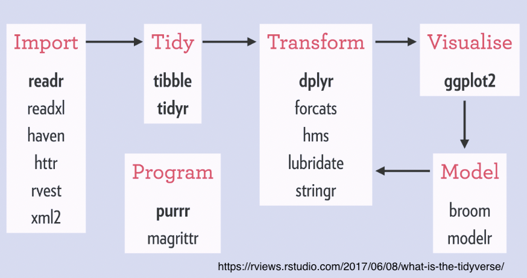
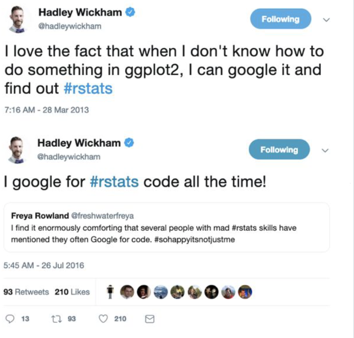

```{r setup, include=FALSE}
knitr::opts_chunk$set(echo = FALSE)
library(tidyverse)
```

## Acknowledgments

Thanks to Thomas Mock, Customer Enablement Lead at RStudio.

https://www.youtube.com/watch?v=MKwyauo8nSI&ab_channel=ThomasMock

Some parts of my presentation are inspired from his.
---
This presentation is available at https://www.justinsavoie.com/ssmw2022
---
## Today's agenda
.pull-left[
* R and RStudio
  * Writing code
  * File manipulation
  * Package control

* R coding basics
  * Math
  * Assignment
  * Functions
  * Load and install packages
]

.pull-right[
* The tidyverse
  * Read data in with readr
  * Tidy data with tidyr
  * Transform data with dplyr

* Putting it together: two examples
  * cleaning data; linear model with predicted values and marginal effects
  * working with text from SCC cases

]

---

## R and RStudio

* R is a programming language for statistical computing and graphics
* RStudio is an IDE (integrated development environment)
* A place to write:
  * Console
  * R scripts
  * R Markdown
  * Code completion
* A place to:
  * work with folders and paths
  * visualize plots, data, files

---

```{r echo=FALSE, out.width= '90%'}
knitr::include_graphics("images/4panes.png")
```

---

```{r echo=FALSE, out.width = '90%'}

```

---

## Common mistakes

```{r echo=FALSE,out.width = '40%'}

```

```{r echo=FALSE,out.width = '40%'}

```

```{r echo=FALSE,out.width = '40%'}
knitr::include_graphics("images/error3.png")
```

Error messages are usually informative.

You can also google the error message.

---

class: center, middle, inverse

# R coding basics (before tidyverse)

---

## R coding basics

Assignment

```{r echo=TRUE}
x <- 2.5
```
```{r echo=TRUE}
y <- 10
```

```{r echo=TRUE}
z <- x*y
z
```
```{r echo=TRUE}
zz <- z + 2 *x
zz
```

---

```{r echo=TRUE}
x1 <- c(2,3,4,10,12,46)
x2 <- c(-1,3,4,10,5,3)
x1+x2
```

```{r echo=TRUE}
x1 <- c(2,3,4,10,12,46)
x2 <- c(-1,3,4,10,5,3,1,1,1.5)
x1+x2
```

---

## Dataframes

```{r echo=TRUE}
my_dataframe <- data.frame(x=c(1,2,3),y=c(3.5,4.5,5.5))
my_dataframe
```
```{r echo=TRUE}
head(mtcars)
```

---

## Functions

```{r eval=FALSE}
function_name(argument1,argument2,...)
```
```{r echo=TRUE}
mean(c(2,3,4))
```
```{r echo=TRUE}
random_vector<- rnorm(n=100,mean=0,sd=1)
mean(random_vector)
sd(random_vector)
IQR(random_vector)
```
---
```{r echo=TRUE}
summary(random_vector)
set.seed(232)
random_vector <- rnorm(n=5,mean=0,sd=1)
set.seed(232)
random_vector <- rnorm(5,0,1)
mean(x=random_vector)
mean(random_vector)
```
---
```{r echo=TRUE}

mtcars$cyl[1:5]

my_quadratic_function <- function(x){
  return(x^2+6*x+14.5)
}

my_quadratic_function(mtcars$cyl[1:5])

mtcars$cylQUADRATIC <- my_quadratic_function(mtcars$cyl)

head(mtcars,3)

```

```{r echo=FALSE}
mtcars <- mtcars %>% select(-cylQUADRATIC)
```
---
## Other useful functions
```{r echo=TRUE}
seq(from=1,to=3.5,by=0.5)
seq(from=1,to=3.5,by=0.51)
seq(from=-2,to=2,length.out=7)
```
---
## Other useful functions
```{r echo=TRUE}
table(mtcars$cyl)
ifelse(c(3,3,6,8)>5,1,0)
```
---
## Other useful functions
```{r echo=TRUE, out.width='40%'}
plot(mtcars$mpg,mtcars$hp)
```
---
## indexing
```{r echo=TRUE}
x <- c(1,2,3)
x[2]
x[2:3]
mtcars$mpg[c(1,3)]
```
---
## indexing
```{r echo=TRUE}
mtcars[1:3,4:5]
```
---
## indexing
```{r echo=TRUE}
x[3] <- NA
x

mtcars$mpg[mtcars$mpg>20]
```
---
## indexing
```{r echo=TRUE}

x <- mtcars$mpg
x
x[x>20] <- 1000
x
```
---
## logical operators

```{r echo=TRUE}
2>3 # 2 is bigger than 3
3>2 # 3 is bigger than 2
2==2 # 2 is equal to 2
2.00000001==2
3!=2 # 3 is not equal to 2
```
---
## logical operators
```{r echo=TRUE}
4 %in% c(2,4,5) # 4 is in the vector
!(4 %in% c(2,4,5)) # 4 is not in the vector
(5 | 6)==6 # 5 or 6 is equal to 6
(5 & 6) %in% c(5,6) # 5 and 6 is in vector
is.na(c(2,3,NA)) # value is NA
```

---
## working directory
```{r echo=TRUE, eval=FALSE}
my_data <- read_delim("/Users/justinsavoie/Downloads/
                      2019 Canadian Election Study - Phone Survey v1.0.tab")

setwd("~/Dropbox (Personal)/UofT/thisprojectimworkingon/")
my_data <- read_delim("/data/
                      2019 Canadian Election Study - Phone Survey v1.0.tab")

```

To know a file's location: 

on mac: cmd-i on file and copy 'where'

on pc: right click file and copy 'property'
---
## working directory
```{r echo=FALSE,out.width='85%'}

```
---
## working directory
```{r echo=FALSE,out.width='85%'}

```
---
## The %>% (the 'pipe') and intro to tidyverse
```{r eval=FALSE, echo=TRUE}
did_something <- do_something(data)
did_another_thing <- do_another_thing(did_something)
do_last_thing <- do_last_thing(did_another_thing)
```

```{r eval=FALSE, echo=TRUE}
final_thing <- do_last_thing(
  do_another_thing(
    do_something(data)
  )
)
```

```{r eval=FALSE, echo=TRUE}
final_thing <- data %>%
  do_something() %>%
  do_another_thing() %>%
  do_last_thing()
```
---
## The %>%
```{r echo=TRUE}
mean(c(1,2,3));
c(1,2,3) %>% mean()
```
---
## The %>%
```{r echo=TRUE}
xplus6 <- function(x) x+6
xminus2 <- function(x) x+2
xtotwothird <- function(x) x^(2/3)
my_vector <- c(3,4,2)
my_vector %>%
  xplus6() %>%
  xminus2() %>%
  xtotwothird() %>%
  mean()
mean(xtotwothird(xminus2(xplus6(my_vector))))
```
---
## The %>%
do_something(data) is equivalent to:

> - data %>% do_something(data=.)
> - data %>% do_something(.)
> - data %>% do_something()
---
## The %>%
```{r echo=FALSE, out.width='100%'}

```
---
```{r echo=TRUE,message=FALSE,warning=FALSE}
ces <- read_csv("https://www.justinsavoie.com/data/dataces1.txt")
head(ces) 
```
---
## The %>%
```{r echo = TRUE}
ces %>%
  filter(q4_province=="(5) Quebec") %>%
  group_by(q3_gender) %>%
  summarise(mean_birthyear=mean(q2_birthyear),
            sd=sd(q2_birthyear))
```
---
## The %>% 
```{r echo = TRUE}
ces %>%
  group_by(q4_province,q3_gender) %>%
  summarise(mean_birthyear=mean(q2_birthyear),
            sd=sd(q2_birthyear)) %>%
  head(5)
```
---

class: center, middle, inverse

# The tidyverse
---
## The tidyverse
- The tidyverse is an opinionated collection of R packages designed for data science.

- All packages share an underlying design philosophy, grammar, and data structures.

- tidyverse is a R package. But it's also a package of packages.

- Core packages: `readr, tidyr, dplyr, ggplot2`
---
## tidyverse
```{r echo=FALSE, out.width='100%'}

```
---
## tidyverse
```{r echo=FALSE, out.width='100%'}

```
---
## Statistical inference using the tidyverse
```{r echo=FALSE, out.width='100%'}

```
---
## tidyverse
```{r echo=FALSE, out.width='85%'}

```
---
## Install and load packages
* Install package once on your computer.
```{r eval=FALSE, echo=TRUE}
install.packages('tidyverse')
```

* Each time you run R, load the package.

```{r eval=FALSE, echo=TRUE}
library(tidyverse)
```
---
## tidyverse vs Base R

* People often contrast tidyverse and "base R"
* Many things can be done either in base R and with tidyverse
* Of course in practice, people use both. In particular: you need base R when you use the tidyverse for all the basic stuff.

```{r eval=FALSE, echo=TRUE}
read.csv("...")
read_csv("...")

plot(data$x,data$y)
ggplot(data,aes(x=x,y=y)) + geom_point()
```
---
## tidyverse vs Base R

```{r  echo=TRUE}
tapply(mtcars$mpg,mtcars$cyl,mean)
mtcars %>% group_by(cyl) %>% summarise(mean(mpg))
```
---
## tidyverse vs Base R

```{r  echo=TRUE,eval=FALSE}
mtcars$new_var <- rnorm(nrow(mtcars),0,1)
mtcars <- mtcars %>%
  mutate(new_var=rnorm(nrow(.),0,1))
  
```
---
## tidyverse core principles

* Built about two-dimensional data (data.frame or tibble)
* Built around tidy data
  * Each variable in it's own column
  * Each observation in its own row
  * Each type of observational units forms a table
---
## Tidy data

```{r  echo=TRUE}

head(ces)
  
```
---
## Untidy data

```{r  echo=TRUE}

(untidy_df <- tibble(age=18:30,
       male_2016=round(rnorm(13,50000,5000)),
       female_2016=round(rnorm(13,50000,5000)),
       male_2017=round(rnorm(13,50000,5000)),
       female_2017=round(rnorm(13,50000,5000)),
       male_2018=round(rnorm(13,50000,5000)),
       female_2018=round(rnorm(13,50000,5000)))) %>% head(10)
```
---
## Tidy data

```{r  echo=TRUE}

(tidy_df <- untidy_df %>%
  pivot_longer(-age,names_to = c("gender","year"),
               values_to = "value",names_sep = "_"))
```
---
## Read data

Read in data with `readr, haven, readxl`. 

I've also used `readstata13` which is not in tidyverse.

* `readr`
  * `read_csv(),read_tsv(),read_delim()`

* `haven`
  * `read_sas(),read_spss(),read_stata()`

* `readxl`
  * `read_xls(),read_xlsx(),read_excel()`

For example:

```{r echo=TRUE, eval=FALSE}
df <- read_csv("~/Desktop/mydata.csv")
```
  
---

## dplyr package

* 6 main verbs
  * `filter()` keep only certain rows
  * `arrange()` order rows by order in a variable
  * `select()` keep only certain variables
  * `mutate()` create a variable
  * `group_by()` group by values in a variable
  * `summarise()` summarise e.g. mean, sd etc.

* simple functions
  * `pull()` extract one variable and make it vector
  * `n()` and `count()` 
  * `glimpse()` give summary of data

---
## dplyr package

* advanced iterations
  * `summarize_at` summarise on many variables
  * `mutate_at` create/modify many variables
  * `summarize_all`
  * `mutate_all`

* for more info
  * dplyr.tidyverse.org
  * R for Data Science
  * Google
  * Stack Overflow
---

```{r echo=FALSE, out.width='50%'}

```
---
## mtcars dataset

```{r echo=TRUE}
class(mtcars)
mtcars_tbl <- as_tibble(mtcars)
class(mtcars_tbl)
```
---
## mtcars dataset

```{r echo=TRUE}
mtcars
```
---
## mtcars dataset

```{r echo=TRUE}
mtcars_tbl
```
---
## mtcars dataset

```{r echo=TRUE}

mtcars_tbl <- mtcars %>%
  mutate(name=row.names(.)) %>%
  as_tibble()

head(mtcars_tbl,3)

```
---
## mtcars dataset

```{r echo=TRUE}

mtcars <- mtcars_tbl

```
---
## dplyr::slice()

```{r echo=TRUE}

mtcars %>% slice(c(1,2,3))

```
---
## dplyr::slice()

```{r echo=TRUE}

mtcars %>% slice(c(1,4,5))

```
---
## dplyr::glimpse()

```{r echo=TRUE}

mtcars %>% glimpse()

```
---
## dplyr::filter()

```{r echo=TRUE}

mtcars %>% filter(cyl==4)

```
---
## dplyr::filter()

```{r echo=TRUE}

mtcars %>% filter(cyl!=4)

```
---
## dplyr::filter()

```{r echo=TRUE}

mtcars %>% filter(cyl %in% c(4,6))

```
---
## dplyr::select()

```{r echo=TRUE}

select(mtcars,hp,mpg,cyl)

```
---
## dplyr::select()

```{r echo=TRUE}

mtcars %>% select(-mpg)

```
---
## dplyr::select()

```{r echo=TRUE}

mtcars %>% select(starts_with("c"),starts_with("h"))

```
---
## dplyr::arrange()

```{r echo=TRUE}

mtcars %>% arrange(mpg)

```
---
## dplyr::arrange()

```{r echo=TRUE}

mtcars %>% arrange(desc(mpg))

```
---
## dplyr::arrange()

```{r echo=TRUE}

mtcars %>% arrange(desc(cyl),disp)

```

---
## dplyr::mutate()

```{r echo=TRUE}

mtcars %>% 
  mutate(hpsquare=hp^2) %>%
  select(mpg,cyl,disp,hp,hpsquare)

```
---
## dplyr::mutate()

```{r echo=TRUE}

mtcars %>% 
  mutate(randomnoise=rnorm(nrow(.),mean=0,sd=1),
         mpg_with_random_noise = mpg+randomnoise) %>%
  select(mpg,cyl,disp,randomnoise,mpg_with_random_noise)

```
---
## dplyr::mutate()

```{r echo=TRUE}

mtcars %>% 
  mutate(cyl=factor(cyl,levels=c(4,6,8),
                    labels=c("4 Cyl","6 Cyl","8 Cyl")))

```
---
## more on factors

```{r echo=TRUE}

vect <- c("Much less","About the same","Much more")
class(vect)
table(vect)
vect <- factor(vect,levels=c("Much less","About the same","Much more"))
class(vect)
table(vect)
```
---
## more on factors

```{r echo=TRUE}
vect <- factor(vect,levels=c("Much less","About the same","Much more"),
               labels=c("ml","abs","mm"))
vect
as.numeric(vect)
```
---
## more on factors

```{r echo=TRUE}

vect <- 1:22
factor(vect)

vect <- as.character(1:22)
(fct_vect <- factor(vect))
as.numeric(fct_vect)
```
---
## more on factors

```{r echo=TRUE}

mtcars %>%
  mutate(cyl=factor(cyl,levels=c(4,6,8),
                    labels=c("4 Cyl","6 Cyl","8 Cyl")),
         cyl2 = fct_recode(cyl,"Small"="4 Cyl",
                            "Big"="6 Cyl",
                            "Big"="8 Cyl")) %>%
  select(cyl,cyl2)

```
---
## more on factors

```{r echo=TRUE}

temp <- mtcars %>%
  mutate(cyl_f=factor(cyl,levels=c(4,6,8),
                    labels=c("4 Cyl","6 Cyl","8 Cyl")),
         cyl2 = fct_recode(cyl_f,"Small"="4 Cyl","Big"="6 Cyl","Big"="8 Cyl"),
         cyl2REV=fct_relevel(cyl2,"Big","Small"))
table(temp$cyl2)
table(temp$cyl2REV)
```
---
## dplyr::mutate()

```{r echo=TRUE}

mtcars %>%
  mutate(miles_per_liter = mpg*3.78,
         miles_per_gallon=miles_per_liter/3.78) %>%
  select(miles_per_liter,mpg,miles_per_gallon)

```
---
## dplyr::group_by()

```{r echo=TRUE}

mtcars %>%
  group_by(cyl)

```
---
## dplyr::group_by()

```{r echo=TRUE}

mtcars %>%
  group_by(cyl) %>%
  mutate(mean_mpg_per_cyl=mean(mpg)) %>%
  select(mpg,cyl,disp,mean_mpg_per_cyl)

```
---
## dplyr::group_by()

```{r echo=TRUE}

mtcars %>%
  group_by(cyl) %>%
  mutate(max_mpg_per_cyl=max(mpg))%>%
  select(mpg,cyl,disp,max_mpg_per_cyl)

```
---
## dplyr::group_by()

```{r echo=TRUE}

mtcars %>%
  arrange(cyl,desc(mpg)) %>%
  group_by(cyl) %>%
  mutate(n=1:n()) %>%
  filter(n==1)

```
---
## dplyr::group_by()

```{r echo=TRUE}

mtcars %>%
  arrange(cyl,mpg) %>%
  group_by(cyl) %>%
  mutate(n=1:n()) %>%
  mutate(type=ifelse(n==1,"Best in class","Other")) %>%
  select(cyl,mpg,type,name)

```
---
## dplyr::group_by()

```{r echo=TRUE}

mtcars %>%
  group_by(cyl) %>%
  filter(hp==max(hp))

```
---
## dplyr::group_by()

```{r echo=TRUE}

mtcars %>%
  group_by(cyl) %>%
  top_n(1,hp)

```
---
## dplyr::group_by()

```{r echo=TRUE}

mtcars %>%
  group_by(cyl) %>%
  arrange(desc(hp)) %>%
  slice(1)

```
---
## dplyr::group_by()

```{r echo=TRUE}

mtcars %>%
  group_by(cyl,am) %>%
  count()

```
---
## dplyr::summarize()

```{r echo=TRUE}

mtcars %>%
  summarise(mean=mean(mpg))

```
---
## dplyr::summarize()

```{r echo=TRUE}

mtcars %>%
  group_by(cyl) %>%
  summarise(mean=mean(mpg))

```
---
## dplyr::summarize()

```{r echo=TRUE}

mtcars %>%
  group_by(cyl) %>%
  mean(mpg)

```
---
## dplyr::summarize()

```{r echo=TRUE}

mtcars %>%
  group_by(cyl) %>% 
  pull(mpg) %>%
  mean()

```
---
## dplyr::summarize()

```{r echo=TRUE}

mtcars %>%
  group_by(cyl) %>%
  summarise(median_mpg=median(mpg),
            mean(mpg),
            sd_mpg=sd(mpg),
            n=n())

```
---
## dplyr::mutate_at()

```{r echo=TRUE}

mtcars %>%
  mutate_at(.vars = vars(cyl,am),factor) %>%
  select(cyl,am) %>%
  glimpse()
```
---
## dplyr::summarise_at()

```{r echo=TRUE}

mtcars %>%
  group_by(cyl) %>%
  summarise_at(.vars=vars(mpg,disp,qsec),.funs=mean)
```
---
## dplyr::summarise_at()

```{r echo=TRUE}

mtcars %>%
  group_by(cyl) %>%
  summarise_at(.vars=vars(mpg,disp,qsec),
               .funs=list(mean = mean, median = median, max=max,min=min))
```
---
## tidyr

Package to clean data and create tidy data. Tidy data is:

* Each variable is in a column
* Each observation is a row
* Each value is a cell
---

## This is not tidy

```{r echo=TRUE}
untidy_df
```

---

## tidy from wide to long

```{r echo=TRUE}
tidy_df <- untidy_df %>%
  pivot_longer(-age,names_to = c("gender","year"),
               values_to = "value",names_sep = "_")

tidy_df  
```
---
## make from long to wide

```{r echo=TRUE}
pivot_wider(tidy_df,
            names_from=c("gender","year"),
            values_from="value")
```
---
## ggplot2

* Build the base with `ggplot()`. Then add layers with `geom_point()`, `geom_line()`, `geom_bar()`, `geom_boxplot()`...etc
* Add labels, themes, change the axis ticks etc.
* Extremely flexible
---

## ggplot2

```{r echo=TRUE,fig.align='center',fig.height = 4}
ggplot(data=mtcars,aes(x=hp,y=mpg)) +
  geom_point() 
```
---
## ggplot2

```{r echo=TRUE,fig.align='center',fig.height = 4}
ggplot(data=mtcars,aes(x=hp,y=mpg,color=factor(cyl))) +
  geom_point() 
```
---
## ggplot2

```{r echo=TRUE, warning=FALSE,message=FALSE,fig.align='center',fig.height = 3}
(g <- ggplot(data=mtcars,aes(x=hp,y=mpg,color=factor(cyl))) +
   geom_point() +
   geom_smooth(method="lm",se=FALSE) +
   geom_smooth(aes(x=hp,y=mpg,color="1"),color="black",method = "lm",se=FALSE) +
   labs(x="Some X-ax title",y="Some Y-ax title",title="Some title",
       color="Cyl",subtitle = "Some subtitle",caption="Source: My source") +
   scale_x_continuous(limits=c(0,400)) +
   scale_y_continuous(limits=c(0,50)) +
   theme_dark() +
   theme(legend.title = element_text(size=12)) +
   scale_color_manual(values=c("grey","green","pink"))) + facet_wrap(~factor(am))
```

---
## ggplot2

If you are interested in Data Viz, I highly recommend:

**Data Visualization and Data Exploration using R**

**with Dr. Alicia Eads**

Thursday, April 28, 1-4pm, SSMW 2022
---

class: center, middle, inverse

# Putting it together: two examples

---

# The 2019 Canadian Election Study

https://dataverse.harvard.edu/dataset.xhtml?persistentId=doi:10.7910/DVN/8RHLG1

```{r echo=TRUE, warning=FALSE,message=FALSE}
library(readstata13)
df <- read.dta13("data/2019 Canadian Election Study - Phone Survey v1.0.dta")

ces_2019_subset <- df %>%
  select(q2,q3,q4,q6,q9,q10,q11,q14,q15,q31,q32,weight_CES) %>%
  as_tibble()

ces_2019_subset %>% glimpse()

```
---

```{r echo=TRUE}
ces_2019_subset <- ces_2019_subset %>%
  rename(q2_birthyear=q2,q3_gender=q3,q4_province=q4,
         q6_satisfied_democracy=q6,q9_interest_election=q9,
         q10_certain_vote=q10,q11_vote_intention=q11,
         q14_feeling_liberal_party=q14,q15_feeling_cons_party=q15,
         q31_ecnchange=q31,q32_policies_fed_gov_ecn=q32)

ces_2019_subset <- ces_2019_subset %>%
  # Q14 and Q15 have negative values which should be NAs
  # See codebook
  mutate(q14_feeling_liberal_party=ifelse(q14_feeling_liberal_party<0,
                                          NA,q14_feeling_liberal_party),
         q15_feeling_cons_party=ifelse(q15_feeling_cons_party<0,
                                          NA,q15_feeling_cons_party))

```

---

```{r echo=TRUE}
ces_2019_subset <- ces_2019_subset %>%
  mutate(q11_vote_intention=fct_recode(q11_vote_intention,
      "(4) Bloc Québécois (BQ, PQ, Bloc, Parti Québécois)"=
      "(4) Bloc Québécois (BQ, PQ, Bloc, Parti Québécois)"))

```

---

```{r echo=TRUE}
ces_2019_subset %>%
  group_by(q3_gender) %>%
  summarise(avg_feeling_lib=mean(q14_feeling_liberal_party,na.rm=TRUE))
```

---

```{r echo=TRUE}
to_plot <- ces_2019_subset %>%
  group_by(q3_gender,q4_province) %>%
  summarise(avg_feeling_lib=mean(q14_feeling_liberal_party,na.rm=TRUE),.groups = 'drop')
to_plot
```

---

```{r echo=TRUE,fig.height=4}
to_plot %>%
  filter(q3_gender!="(3) Other") %>%
  ggplot(aes(x=q3_gender,y=avg_feeling_lib,fill=q4_province)) +
  geom_bar(stat = "identity",position="dodge")
```
---
```{r echo=TRUE,fig.height=4}
to_plot %>%
  filter(q3_gender!="(3) Other") %>%
  ggplot(aes(x=q3_gender,y=avg_feeling_lib,fill=q4_province)) + 
  geom_bar(stat = "identity",position="dodge") + 
  geom_text(aes(label=round(avg_feeling_lib)),
            position = position_dodge(width = .9),vjust=-0.25)
```

---

```{r echo=TRUE}
to_plot <- ces_2019_subset %>%
  mutate(q4_province_2=fct_recode(q4_province,"Atlantic"="(1) Newfoundland and Labrador",
                                  "Atlantic"="(2) Prince Edward Island",
                                  "Atlantic"="(3) Nova Scotia",
                                  "Atlantic"="(4) New Brunswick")) %>%
  group_by(q3_gender,q4_province_2) %>%
  summarise(avg_feeling_lib=mean(q14_feeling_liberal_party,na.rm=TRUE),
            .groups = 'drop')

```

---

```{r echo=TRUE,fig.height=4}
to_plot %>%
  filter(q3_gender!="(3) Other") %>%
  ggplot(aes(x=q3_gender,y=avg_feeling_lib,fill=q4_province_2)) +
  geom_bar(stat = "identity",position="dodge") +
  geom_text(aes(label=round(avg_feeling_lib)),position =
              position_dodge(width = .9),vjust=-0.25)
```

---

```{r echo=TRUE}
to_plot <- ces_2019_subset %>%
  mutate(q4_province_2=fct_recode(q4_province,"Atlantic"="(1) Newfoundland and Labrador",
                                  "Atlantic"="(2) Prince Edward Island",
                                  "Atlantic"="(3) Nova Scotia",
                                  "Atlantic"="(4) New Brunswick")) %>%
  group_by(q3_gender,q4_province_2) %>%
  summarise(avg_feeling_lib=weighted.mean(q14_feeling_liberal_party,
                                          weight_CES,na.rm=TRUE),.groups = 'drop')

```

---

```{r echo=TRUE,fig.height=4}
to_plot %>%
  filter(q3_gender!="(3) Other") %>% ggplot(aes(x=q3_gender,y=avg_feeling_lib,
    fill=q4_province_2)) + geom_bar(stat = "identity",position="dodge") +
  geom_text(aes(label=round(avg_feeling_lib)), 
            position =position_dodge(width = .9),vjust=-0.25)
```

---

```{r echo=TRUE}
to_plot <- ces_2019_subset %>%
  mutate(q4_province_2=fct_recode(q4_province,"Atlantic"="(1) Newfoundland and Labrador",
                                  "Atlantic"="(2) Prince Edward Island",
                                  "Atlantic"="(3) Nova Scotia",
                                  "Atlantic"="(4) New Brunswick")) %>%
  group_by(q3_gender,q4_province_2) %>%
  summarise(avg_feeling_cons=weighted.mean(q15_feeling_cons_party,weight_CES,na.rm=TRUE),
            avg_feeling_lib=weighted.mean(q14_feeling_liberal_party,weight_CES,na.rm=TRUE),.groups = 'drop')

```

---

```{r echo=TRUE,fig.height=5}
to_plot %>%
  pivot_longer(c("avg_feeling_cons","avg_feeling_lib"),names_to = "party",values_to = "value") %>% filter(q3_gender!="(3) Other") %>%
  ggplot(aes(x=q3_gender,y=value,fill=party)) + geom_bar(stat = "identity",position="dodge") +
  geom_text(aes(label=round(value)),position = position_dodge(width = .9),vjust=-0.25) +
  facet_wrap(~q4_province_2) + scale_fill_manual(values=c("darkblue","red"))
```

---

```{r echo=TRUE}
to_plot <- ces_2019_subset %>%
  filter(q31_ecnchange %in% c("(1) Better", "(2) Worse", "(3) About the same")) %>%
  mutate(q31_ecnchange=factor(q31_ecnchange,c("(2) Worse","(3) About the same","(1) Better"),
                              labels=c("Worse","About the same","Better"))) %>%
  mutate(q4_province_2=fct_recode(q4_province,"Atlantic"="(1) Newfoundland and Labrador",
                                  "Atlantic"="(2) Prince Edward Island",
                                  "Atlantic"="(3) Nova Scotia",
                                  "Atlantic"="(4) New Brunswick")) %>%
  group_by(q3_gender,q4_province_2,q31_ecnchange) %>%
  summarise(sum_weightsQ31=sum(weight_CES),.groups = 'drop') %>%
  group_by(q3_gender,q4_province_2) %>%
  mutate(pc=sum_weightsQ31/sum(sum_weightsQ31))

```

---

```{r echo=TRUE,fig.height=6,fig.width=12,fig.align='center'}
to_plot %>%
  ggplot(aes(x=q31_ecnchange,y=pc,fill=q3_gender)) + facet_wrap(~q4_province_2) +
  geom_bar(stat = "identity",position="dodge") +
  geom_text(aes(label=round(pc*100)),position = position_dodge(width = .9),vjust=-0.25) +
  labs(title="Feeling about the economy by gender and province")
  
```

---

$$Feeling Lib Party_i = B0+B1*PoliciesFedGovEcn_i+B2*birthyear_i+B3*gender_i+u_i$$
```{r echo=TRUE}

ces_2019_subset <- ces_2019_subset %>%
  filter(!(q31_ecnchange %in%
  c("(-9) Don't know", "(-8) Refused", "(-7) Skipped"))) %>%
  mutate(q31_ecnchange_numeric=
           as.numeric(factor(q31_ecnchange,
  c("(2) Worse","(3) Not made much difference","(1) Better"))))

to_model <- ces_2019_subset %>%
  select(q14_feeling_liberal_party,q31_ecnchange_numeric,
         q2_birthyear,q3_gender,q4_province) %>%
  filter(complete.cases(.)) %>%
  mutate(age=2019-q2_birthyear)

m <- lm(q14_feeling_liberal_party~q31_ecnchange_numeric+
          age+q3_gender+q4_province,to_model)

```

---

```{r echo=TRUE}

summary(m)

```

```{r echo=TRUE}
library(emmeans)

emmeans(m,specs = "q31_ecnchange_numeric",
        at=list(q31_ecnchange_numeric=c(1,2,3)))

```

---

```{r echo=TRUE}
library(emmeans)

emmeans(m,specs = "q31_ecnchange_numeric",
        at=list(q31_ecnchange_numeric=c(1,3))) %>%
  contrast( method = "pairwise", infer=TRUE)

```

---

```{r echo=TRUE}
to_model$prediction <-  predict(m)

myrmse <- round(sqrt(mean((to_model$q14_feeling_liberal_party-
                             to_model$prediction)^2)),1)


```

---

```{r echo=TRUE,fig.height=4}
ggplot(to_model,aes(x=q14_feeling_liberal_party,y=prediction)) +
  geom_jitter() +
  labs(title=paste0("predictions and true values plotted: rmse=",myrmse))
```
---
## SCC cases

58 cases from the SCC in 2021. Can be accesses through link below. Can also be downloaded as a single zip.

```{r eval=FALSE, echo=TRUE}
library(tidyverse)
library(textreadr)
library(ldatuning)
library(topicmodels)
library(tidytext)
# https://decisions.scc-csc.ca/scc-csc/scc-csc/en/2021/nav_date.do
download.file("justinsavoie.com/data/2021.zip","~/Downloads/2021.zip")
```

See https://www.tidytextmining.com/topicmodeling.html for more info on tidy text analysis. 
---

```{r echo=TRUE,eval=FALSE}
folder_2021 <- "~/Downloads/2021"
paths <- file.path(folder_2021,list.files(folder_2021))
my_list <- list()

for (k in 1:length(paths)){
  doc <- textreadr::read_docx(paths[k])
  citation <- str_replace(doc[2],"Citation: ","")
  
  start <- which(grepl("Present: ",doc))+3
  end <- which(grepl("Cases Cited",doc))-1
  
  if (length(start)==0 & length(end)==0){
    next
  }
  
  doc_sub <- doc[start:end]
  df <- tibble(paragraph=paste0(doc_sub,collapse=" "),citation=citation)
  
  my_list[[k]] <- df %>%
    unnest_tokens(word, paragraph) %>%
    mutate(word=str_replace(word,"\\.","")) %>%
    filter(!grepl('[0-9]',word)) %>%
    filter(nchar(word)>4)
}

df_words <- bind_rows(my_list)

```
---

```{r echo=TRUE,eval=FALSE}
df_words %>%
  group_by(citation,word) %>%
  summarise(n=n()) %>%
  group_by(citation) %>%
  mutate(pc=n/sum(n)) %>%
  arrange(citation,desc(pc)) %>%
  group_by(citation) %>%
  slice(1:5) %>%
  ungroup() %>%
  ggplot(aes(x=word,y=pc)) +
  geom_bar(stat="identity") +
  facet_wrap(~citation,scales = "free")
```

---

```{r echo=TRUE,eval=FALSE}
dtm <- cast_dtm(df_words%>%group_by(citation,word)%>%summarise(n=n()),
         citation,word,n)

modelLDA <- LDA(dtm,k=3)
wtp <- tidy(modelLDA,matrix="beta")

wtp %>%
  arrange(topic,desc(beta)) %>%
  group_by(topic) %>%
  slice(1:5) %>%
  mutate(term = reorder_within(term, beta, topic)) %>% 
  ggplot(aes(y=term,fill=factor(topic),x=beta)) +
  geom_bar(stat = "identity",position = "dodge") +
  facet_wrap(~topic,ncol=1,scales = "free") + scale_y_reordered()
```
---
Discussion of ideal number of topics https://cran.r-project.org/web/packages/ldatuning/vignettes/topics.html

```{r echo=TRUE,eval=FALSE}

result <- FindTopicsNumber(
  dtm,
  topics = seq(from = 2, to = 50, by = 1),
  metrics = c("Griffiths2004", "CaoJuan2009", "Arun2010", "Deveaud2014"),
  method = "Gibbs",
  verbose = TRUE
)

FindTopicsNumber_plot(result)

modelLDA <- LDA(dtm,k=9)
wtp <- tidy(modelLDA,matrix="beta")

```
---
```{r echo=TRUE,eval=FALSE}
wtp %>%
  arrange(topic,desc(beta)) %>%
  group_by(topic) %>%
  slice(1:10) %>%
  mutate(term = reorder_within(term, beta, topic)) %>% 
  ggplot(aes(y=term,x=beta)) + geom_bar(stat = "identity",position = "dodge") +
  facet_wrap(~topic,scales = "free") + scale_y_reordered()

```

---

class: center, middle, inverse

# Thank you! Questions, comments, discussions ...